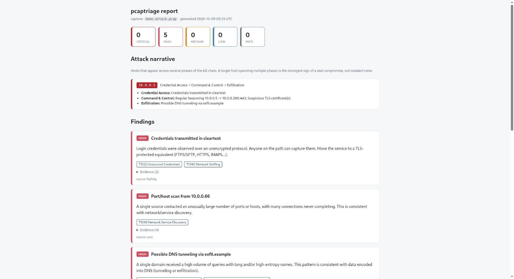
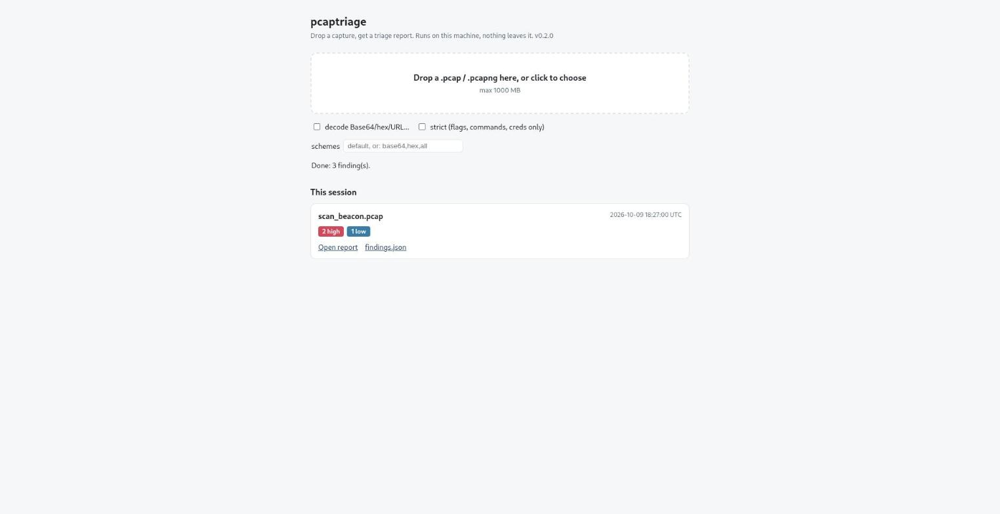

# pcaptriage

[](https://pypi.org/project/pcaptriage/)
[](https://pypi.org/project/pcaptriage/)
[](LICENSE)

Triage automatique de captures reseau, construit au-dessus de **Zeek**.

Wireshark est manuel : tu ouvres un pcap et tu cherches toi-meme. pcaptriage
fait l'inverse. Il laisse Zeek parser les protocoles, puis il applique une
couche de triage : il detecte des comportements suspects, les mappe sur
**MITRE ATT&CK**, et sort un rapport HTML priorise plus un JSON automatisable.
Pensé pour traiter un pcap (ou un dossier entier) en une commande et rendre un
verdict lisible, pas pour remplacer le decodeur de Wireshark.



*Exemple de rapport : un **recit d'attaque** (les hotes qui traversent plusieurs
phases de la kill chain) au-dessus des findings priorises et mappes MITRE ATT&CK.*

## Ce qui le distingue de Zeek / Suricata

Zeek et Suricata produisent des evenements. pcaptriage ajoute la couche qu'ils
ne font pas : il **correle** les findings par hote et les ordonne le long d'une
kill chain simplifiee (Reconnaissance -> Credential Access -> C2 ->
Exfiltration). Un hote qui apparait dans plusieurs phases est signale comme
chaine de compromission probable. C'est le passage de "voici des evenements" a
"voici l'histoire".

## Ce qu'il detecte

| Detection | Signal | MITRE |
|---|---|---|
| Credentials en clair | FTP/HTTP basic auth, services non chiffres | T1552, T1040 |
| Scan de ports / hotes | une source touche beaucoup de ports/hotes, connexions non abouties | T1046 |
| DNS tunneling / exfiltration | fort volume + noms longs/haute entropie vers un domaine | T1071.004, T1048 |
| Beaconing / C2 | rappels a intervalle quasi constant vers une meme destination | T1071, T1095 |
| Certificats TLS suspects | certificats auto-signes, expires ou non valides | T1573 |
| Poisoning LLMNR/NBT-NS/mDNS | un hote repond aux requetes de resolution de noms de plusieurs victimes (style Responder) | T1557.001 |
| Telechargement d'archive/executable | archive ou executable recu en HTTP depuis un serveur externe (le type est lu dans le contenu, pas le nom) | T1105 |
| Envoi de mail en masse (malspam) | un poste contacte >= 10 serveurs de messagerie externes, avec ses pieces jointes | T1566 |

## Prerequis

- **Python 3.9+** (teste sur 3.14). Aucune dependance pip, stdlib uniquement.
- **Zeek**, au choix :
  - local : `zeek` dans le PATH ;
  - **Docker** (recommande sur Kali, ou le paquet .deb casse la libc) :
    ```bash
    docker pull zeek/zeek:lts
    ```

## Installation

### Option 1 : image Docker (Linux, macOS, Windows, rien d'autre a installer)

L'image embarque Zeek et pcaptriage. Seul Docker est requis (Docker Desktop sur
Windows et macOS). C'est la voie la plus simple, et la seule evidente sous
Windows puisque Zeek n'y tourne pas nativement.

```bash
# Linux / macOS : analyser capture.pcap du dossier courant
docker run --rm -v "$PWD:/data" ghcr.io/zakeelm6/pcaptriage capture.pcap

# Linux : eviter des fichiers de sortie appartenant a root
docker run --rm --user "$(id -u):$(id -g)" -v "$PWD:/data" ghcr.io/zakeelm6/pcaptriage capture.pcap

# Windows (PowerShell)
docker run --rm -v "${PWD}:/data" ghcr.io/zakeelm6/pcaptriage capture.pcap

# toutes les options marchent (dossier, --decode, ...)
docker run --rm -v "$PWD:/data" ghcr.io/zakeelm6/pcaptriage ./captures --decode --decode-strict
```

Le rapport est ecrit dans `pcaptriage-report/` a cote de la capture. L'option
`--docker` n'est pas necessaire ici, Zeek est deja dans l'image.

### Option 2 : executable autonome (sans Python)

Chaque release joint un binaire pour Linux, Windows et macOS (Apple Silicon)
construit par GitHub Actions : `pcaptriage-linux-x86_64`,
`pcaptriage-windows-x86_64.exe`, `pcaptriage-macos-arm64`. Pas besoin
d'installer Python. Zeek reste necessaire : sous Windows, passe par Docker.

```bash
./pcaptriage-linux-x86_64 capture.pcap --docker
./pcaptriage-linux-x86_64 serve --docker
```

Les binaires ne sont pas signes : Windows SmartScreen ou macOS Gatekeeper
peuvent demander une confirmation au premier lancement. Verifie le fichier
depuis la page de release de ce depot. Seuls `--version` et `serve --help` sont
testes automatiquement sur chaque OS, l'analyse complete n'a ete testee que sous Linux.

### Option 3 : paquet Python

```bash
# depuis PyPI
pip install pcaptriage
# ou, pour une commande systeme isolee
pipx install pcaptriage

# en developpement, depuis une copie locale
pip install -e .
```

Une fois installe, la commande `pcaptriage` est disponible. Sans installation,
tout marche aussi via `python3 -m pcaptriage`.

## Usage

```bash
# un seul pcap, Zeek via Docker
pcaptriage capture.pcap --docker

# un dossier entier de captures
python3 -m pcaptriage ./captures/ --docker -o resultats/

# decoder le contenu encode dans HTTP/DNS/FTP (CTF/lab)
pcaptriage capture.pcap --docker --decode

# choisir les schemes, et eliminer le bruit (ne garder que l'interessant)
pcaptriage capture.pcap --docker --decode --decode-schemes base64,hex,gzip
pcaptriage capture.pcap --docker --decode --decode-strict

# inventorier les fichiers suspects : nom, domaine, heure, SHA-256, contenu des archives
pcaptriage capture.pcap --docker --artifacts

# Zeek installe en local
python3 -m pcaptriage capture.pcap
```

Avec `--artifacts`, Zeek extrait aussi les archives, executables et documents
Office de la capture. Pour chacun, le rapport donne l'heure (UTC), le nom, le
domaine d'origine, le SHA-256 (utile pour une recherche de reputation, rien n'est
envoye nulle part) et, pour une archive ZIP, la liste des fichiers qu'elle
contient. On ne lit que l'index de l'archive : rien n'est extrait ni execute.
Attention : les fichiers extraits restent sur disque dans
`zeek-logs/artifacts/` et peuvent etre de vrais malwares.

Avec `--decode`, pcaptriage cherche les blobs encodes dans les champs extraits
par Zeek, les decode, et remonte le clair en signalant flags, commandes ou
identifiants. Schemes disponibles : **base64, base32, hex, url, rot13, gzip**
(par defaut), plus **base85** via `--decode-schemes all` (bruyant dans les URI).
On peut aussi n'activer que certains schemes (`--decode-schemes base64,hex`).

Elimination du bruit : les decodages qui tombent sur du charabia imprimable sont
filtres automatiquement (heuristique de sens). `--decode-strict` va plus loin et
ne garde que ce qui contient un flag, une commande ou un identifiant.

C'est du **decodage**, sans clef, a ne pas confondre avec le dechiffrement TLS
(qui exige le materiel de clef et n'est pas encore supporte).

Sortie, par capture, dans le dossier `-o` (defaut `pcaptriage-report/`) :

```
pcaptriage-report/
  <nom-capture>/
    report.html      <- rapport lisible (clair/sombre), findings prioritises
    findings.json    <- meme contenu, automatisable (injectable dans un SIEM)
    zeek-logs/       <- logs Zeek bruts (conn/dns/http/ssl/...)
```

## Validation et tests

`python -m unittest discover -s tests` lance les tests de non-regression (aussi
executes par la CI a chaque push). Le premier test sur une vraie infection, ses
faux positifs et ses limites sont decrits dans [docs/VALIDATION.md](docs/VALIDATION.md).

## Interface web

Pour ne pas passer par la ligne de commande : `pcaptriage serve` ouvre une page
locale ou l'on depose un pcap et ou l'on obtient le rapport.

```bash
# paquet Python (Zeek local, ou --docker)
pcaptriage serve

# avec l'image Docker (ouvre http://localhost:8080)
docker run --rm -p 127.0.0.1:8080:8080 ghcr.io/zakeelm6/pcaptriage serve --host 0.0.0.0 --no-browser
```



Options de decodage (`--decode`, mode strict, schemes) dans la page. Les
analyses de la session sont listees avec leurs liens vers le rapport et le JSON.

Securite : le serveur n'ecoute que sur `127.0.0.1` par defaut et **n'a aucune
authentification**. Il refuse les requetes dont l'en-tete `Host` n'est pas local
(contre le DNS rebinding) et les POST sans l'en-tete `X-Requested-With` (contre
les envois depuis un autre site). Les captures envoyees sont supprimees apres
analyse, et le dossier de travail temporaire est efface a l'arret. Dans un
conteneur, `--host 0.0.0.0` est necessaire : publie alors le port uniquement sur
`127.0.0.1` de la machine hote, comme dans l'exemple ci-dessus, et n'expose
jamais ce port sur un reseau non fiable.

## Architecture

```
pcap --> Zeek (parsing) --> *.log JSON --> loader --> detections --> findings
                                                          |             |
                                                      MITRE map     report HTML + JSON
```

- `zeek_runner.py` lance Zeek (local ou Docker) et produit les logs JSON.
- `pipeline.py` enchaine Zeek, detections, decodage, correlation et rapport ;
  la CLI et l'interface web utilisent le meme code.
- `loader.py` charge les logs en memoire.
- `detections/` : une detection = une fonction decoree `@register` qui prend
  les logs et renvoie des `Finding`. Ajouter une detection = ajouter un fichier.
- `mitre.py` : table technique -> (nom, lien).
- `correlation.py` : relie les findings par hote sur une kill chain (recit d'attaque).
- `decode.py` : decodage optionnel (Base64, hex, gzip...) avec filtre anti-bruit.
- `report.py` : resume de la capture + rendu HTML autonome.
- `artifacts.py` : extraction, hachage et inventaire des fichiers suspects (`--artifacts`).
- `webui.py` : interface web locale (`pcaptriage serve`).
- `cli.py` : arguments, mode fichier ou dossier.

## Feuille de route

- ARP spoofing (demande un petit script Zeek dedie)
- Extraction de fichiers (files.log) et de credentials additionnels
- Moteur de regles externes (YAML/Sigma-like) pour etendre sans coder
- Graphe de communication dans le rapport
- Sortie directe vers Elasticsearch (lien avec Mini-SOC)

## Note

Outil d'analyse defensive / forensic sur des captures que tu es autorise a
analyser. Les logs peuvent contenir des donnees sensibles (identifiants,
hotes) : traite les sorties en consequence.
